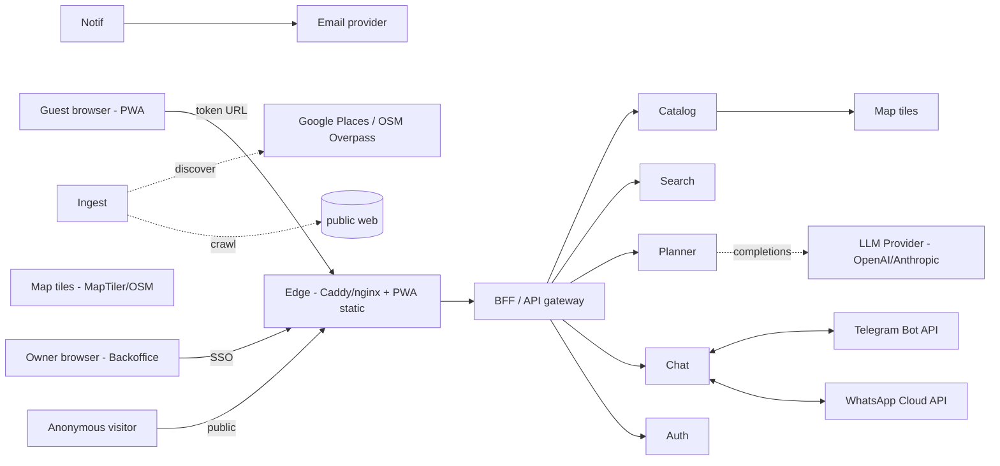
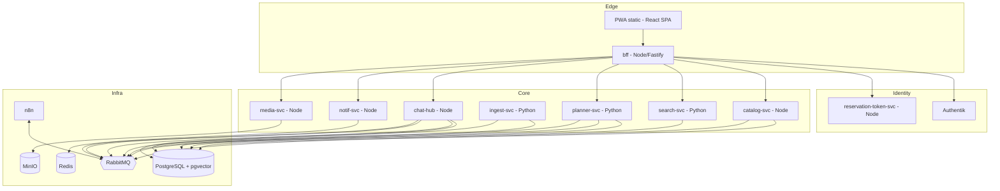

# 03 — Architecture

**Scope**: service boundaries, data flows, integration points, scaling story for the São Miguel guesthouse PWA. Opinionated by design.

---

## 1. System Context

External actors: **Guest** (token-gated), **Anonymous visitor** (public landing only), **Owner** (Authentik SSO). External services: **LLM provider**, **Google Places / OSM Overpass** for ingestion, **Telegram / WhatsApp** for chat bridging, **MapTiler/OSM** for tiles, **SMTP** for transactional mail.

---

## 2. Service Decomposition

We split along **bounded contexts**, not technical layers. Each service owns its tables.

| Service | Lang | Responsibility | Owns |
|---|---|---|---|
| **pwa** | React/TS SPA | UI, service worker, offline cache | — |
| **bff** | Node (Fastify) | Single ingress; aggregates calls, enforces token+SSO, handles WebSockets; no business logic | session cache |
| **reservation-token-svc** | Node | Issues/revokes reservation JWTs; binds to guest+guesthouse+checkout window | `reservation`, `guest`, `token_grant` |
| **authentik** | (3rd party) | Owner & staff SSO/OIDC; no guest identities | its own DB |
| **catalog-svc** | Node | CRUD for guesthouses, places, owner profile, approval state machine | `guesthouse`, `place`, `place_media`, `owner_profile`, `action`, `wish` |
| **search-svc** | Python (FastAPI) | Geo + semantic queries: interest→places. Owns the embedding pipeline. Python wins for vector/NLP libs and pgvector ergonomics | `place_embedding` (logical owner; physical table sits with Catalog DB via shared schema OR replica) |
| **planner-svc** | Python (FastAPI) | Daily Tour generation: prompt assembly, RAG over candidate places, LLM call, itinerary scoring/validation | `tour_plan`, `tour_step` |
| **ingest-svc** | Python | Source-pluggable place discovery (Google Places → OSM → optional crawl); enrichment; dedupe; produces `place.candidate.discovered` | `place_candidate`, `ingest_run` |
| **chat-hub** | Node | Channel-agnostic messaging: WS to PWA, bridges to Telegram/WhatsApp, normalizes to `Message`/`ChatThread` | `chat_thread`, `message`, `channel_binding` |
| **notif-svc** | Node | Email + push (web push); transactional templates | `notification_log` |
| **media-svc** | Node | Pre-signed uploads to MinIO, transcode/thumbnail jobs | `media_asset` |
| **n8n** | (3rd party) | Operational workflows: ingest scheduling, owner approval reminders, daily digests, low-code integrations | n8n internal DB |

**Language rationale**: Node where the work is I/O orchestration, WebSocket fanout, or CRUD with strong type-sharing to the React PWA (BFF, chat, catalog, media, notif, token). Python where the work is ML / vector / RAG / scraping ecosystem (search, planner, ingest).

**What is NOT a service on day 1**: feature flags, billing, analytics pipeline, dedicated config service, ML training. Inline them or skip.

---

## 3. Data Flows — Three Critical Journeys

### 3.1 "Dinner near the sea" → list query
1. PWA → `BFF /v1/discover?action=dinner&wish=sea&loc=...&km=5` with reservation JWT.
2. BFF validates token (cache hit on Redis; cold path = `reservation-token-svc`).
3. BFF → `search-svc.query()`. Search runs **hybrid**: SQL geo-filter (PostGIS `ST_DWithin` on `place.geom`) ∩ category match on `action/wish` tags, then **re-ranks by cosine similarity** between the wish embedding ("dinner near the sea") and `place_embedding.vec`. Limit ~30, return top N grouped by wish.
4. BFF hydrates with `catalog-svc` (denormalized place card payload, signed media URLs from media-svc). Single response < 300 ms p95 target.
5. No RabbitMQ on the read path. Synchronous, idempotent, cacheable.

### 3.2 Daily Tour AI plan → response
1. PWA POSTs form + free-text + token to `BFF /v1/tour-plans`.
2. BFF → `planner-svc.create_plan()`. Planner publishes `tour.requested` to RabbitMQ and returns `202 + plan_id`. PWA opens a WebSocket subscription to `plan:{id}`.
3. Planner worker consumes `tour.requested`:
   - Retrieve guesthouse home, checkout window, locale.
   - Call `search-svc` for candidate places per meal/activity slot (RAG retrieval).
   - Build prompt: system rules (Azores context, distances, opening hours, locale, no fabrication) + structured slots (breakfast/morning/lunch/afternoon/dinner) + candidate list with IDs.
   - LLM completion with **function-calling / JSON-schema output**: itinerary as `[{slot, place_id, start, end, rationale}]`.
   - Validate: every `place_id` exists in candidate set (reject hallucinations), every leg respects max travel time, total within form bounds.
   - Persist `tour_plan`, emit `tour.completed`.
4. Chat-hub-style WS notification reaches the PWA via BFF; user sees streamed status then final plan.

### 3.3 Guest DM owner → routed → reply back
1. PWA opens WS to `BFF /v1/chat` (auth via token). Sends message.
2. BFF → `chat-hub.send()`. Chat-hub persists `Message`, resolves `OwnerProfile.preferredChannel` (telegram/whatsapp/in-app).
3. Chat-hub publishes `message.outbound` → consumer for that channel (Telegram bridge / WhatsApp bridge / in-app push).
4. Owner replies on their app → channel webhook → chat-hub inbound handler → normalize to `Message`, attach to thread by `channel_binding`, publish `message.inbound`.
5. BFF WS pushes to the originating guest. Notif-svc may also send web-push if guest is offline.

---

## 4. Database Sketch (entities, not DDL)

Single Postgres cluster, **schema-per-service** (`catalog`, `chat`, `planner`, `ingest`, `auth_tokens`, `media`, `notif`). Cross-schema reads forbidden; cross-service joins go through APIs or projections. pgvector extension shared.

- **guesthouse** (id, name, geom, address, owner_id, media[])
- **owner_profile** (owner_id, bio, photo, phone_enabled, dm_channels jsonb)
- **reservation** (id, guesthouse_id, guest_id, checkin, checkout, locale)
- **guest** (id, display_name, locale, opt_in_flags)
- **token_grant** (jti, reservation_id, issued_at, expires_at, revoked_at)
- **place** (id, name, geom, address, contacts jsonb, status [draft|owner_approved|published], media[])
- **action** (id, slug, i18n) / **wish** (id, action_id, slug, i18n)
- **place_action_wish** (place_id, action_id, wish_id) — M:N tags
- **place_media** (id, place_id, kind, asset_id, sort)
- **place_candidate** (id, source, source_ref, raw jsonb, dedupe_hash, status)
- **place_embedding** (place_id, vec vector(1024), model_version)
- **chat_thread** (id, reservation_id, owner_id)
- **message** (id, thread_id, direction, channel, ext_ref, body, attachments, ts)
- **channel_binding** (thread_id, channel, ext_chat_id)
- **tour_plan** (id, reservation_id, params jsonb, status) / **tour_step** (plan_id, slot, place_id, start, end, rationale)
- **media_asset** (id, bucket_key, mime, dims, owner_scope)
- **notification_log** (id, kind, target, status)

---

## 5. RabbitMQ — Day 1 Queues

Topic exchange `dt.events`, one queue per consumer. Justify each:

- `place.candidate.discovered` — ingest → catalog (creates draft) and notif (owner-review reminder).
- `place.approved` / `place.published` — triggers re-embedding in search-svc and cache busts.
- `tour.requested` / `tour.completed` — decouples slow LLM work from HTTP; lets us swap workers / retry.
- `message.inbound` / `message.outbound` — channel bridges are independently restartable; back-pressure absorbed.
- `notification.requested` — email/push fanout.
- `reservation.created` / `reservation.cancelled` — token issuance/revocation, owner notif, n8n welcome flow.

**Not on the bus**: read queries, auth checks, anything where the caller needs the result *now*. Avoids the classic "queue everything" trap.

---

## 6. AI / LLM Strategy

**Daily Tour planner**: hosted frontier model (Sonnet-class or 4o-class) — cost is bounded (one call per plan), quality matters. **Prompt = system rules + structured slots + candidate places retrieved by search-svc (RAG)**. Output enforced via JSON schema / function-calling. **Guardrails**: (a) every `place_id` in the output must be in the retrieval set — reject hallucinations server-side; (b) travel-time sanity check between consecutive stops; (c) opening-hours filter applied before retrieval, not trusted from the LLM; (d) per-reservation rate limit; (e) prompt-injection defense — guest free-text is wrapped in a clearly delimited block and never concatenated into system instructions.

**"AI agent reserves a place"**: **defer real automated reservations**. Day 1 ships **draft-and-handoff**: agent drafts the DM in the user's locale, user reviews, taps send → opens the channel app or in-app chat. Real autonomous booking would require per-venue integrations or a browser-agent — both expensive, brittle, and create liability when bookings go wrong. Flag as a long-tail bet, not a v1.

**Internet place-scan**: tiered trust. **Tier 1 = Google Places** (structured, licensed, the floor). **Tier 2 = OSM Overpass** (free, geographic completeness, weaker on contacts/photos). **Tier 3 = targeted web crawl** of official venue sites only, behind robots.txt + rate limit, opt-in per source. Never publish without owner approval — the state machine `candidate → owner_approved → published` is the trust gate. Source + retrieved-at + raw payload kept for audit.

**pgvector reuse**: same `place_embedding` table powers both list search and planner RAG. Embed `name + description + action/wish tags + neighborhood`. One model, one dimension, versioned via `model_version`.

---

## 7. Token-Gated URLs

**Short opaque token in the URL** (`/r/{token}`), exchanged at first load for a **short-lived JWT** held in memory + refresh cookie. The URL token is a lookup key, not a self-contained credential — keeps URLs short, allows instant revocation, avoids leaking claims via screenshots.

JWT claims: `sub=guest_id`, `rid=reservation_id`, `gh=guesthouse_id`, `locale`, `exp` = min(checkout + 24h, issued+1h refresh cycle), `jti`. Revocation = delete `token_grant` row; BFF checks `jti` via Redis cache with short TTL. n8n flow auto-revokes on `reservation.cancelled` and on checkout+24h.

---

## 8. Real-Time Chat Transport

**WebSocket via BFF**, one connection multiplexing chat + tour-plan status + presence. Rationale: bidirectional, mature in browsers, plays well with PWA service worker, single auth handshake. SSE was tempting (simpler) but we already need client→server frames for typing indicators and the WS gives us one transport for everything realtime. Fallback to long-poll only if a corporate proxy blocks WS.

**Channel bridge**: chat-hub exposes a **driver interface** (`send`, `receive_webhook`, `normalize`). Telegram and WhatsApp drivers are independent modules, each with their own webhook endpoint on chat-hub. New channel = new driver, no core changes. Owner picks preferred outbound channel in `owner_profile.dm_channels`; inbound always normalizes to the same `Message` shape.

---

## 9. Observability & Deploy

**Logs**: structured JSON to stdout, shipped by a single Loki/Promtail or Vector container. **Metrics**: Prometheus scraping each service's `/metrics`; one Grafana with 4 dashboards (RED per service, RabbitMQ, Postgres, host). **Traces**: OpenTelemetry SDK in every service, OTLP → Tempo (or Jaeger). Trace ID propagated by BFF, mandatory across the LLM call.

**Deploy**: two Ubuntu 24 VPSes (QA, Prod). Docker Compose per environment, files in repo. CI (GitHub Actions): on tag → build images → push to GHCR → SSH deploy script does `docker compose pull && up -d` with healthchecks. **Backups**: nightly `pg_dump` + MinIO snapshot to off-host object storage. Secrets via Docker secrets / `.env` per host (no secrets in the image).

---

## 10. Scaling Story

**Stays simple at startup**:
- Single Postgres, schema-per-service (not separate DBs). Easy backups, cheap.
- Single RabbitMQ node. Single MinIO. Single Redis. All on the Prod VPS.
- Compose, not Kubernetes. One nginx/Caddy at the edge.
- WebSockets terminated at BFF; in-memory fanout — fine for hundreds of concurrent guests.

**Stub now, grow later** (designed-for, not built-for):
- Schema-per-service means we can extract a service's schema to its own DB later without code rewrite.
- RabbitMQ queues already decouple producers/consumers — scale consumers horizontally when load demands.
- chat-hub uses Redis pub/sub for cross-instance WS fanout the day we run > 1 replica.
- Embedding model + table versioned (`model_version`) so we can roll new embeddings in parallel.

**One-way doors** (decide carefully now):
- **Token shape** (opaque → JWT exchange). Changing later forces guest re-onboarding.
- **Schema-per-service vs DB-per-service**: we chose schema-per-service; the migration to per-DB is mechanical because cross-schema joins are banned from day 1.
- **WebSocket as the single realtime transport** — committing to one transport beats half-supporting two.
- **Channel-binding model** in chat — picking the right normalization shape now avoids painful migrations when WhatsApp/Signal/iMessage get added.

**Explicitly deferred**: Kubernetes, multi-region, dedicated read replicas, event sourcing, CQRS, billing service, ML training infra, autonomous booking agent.
