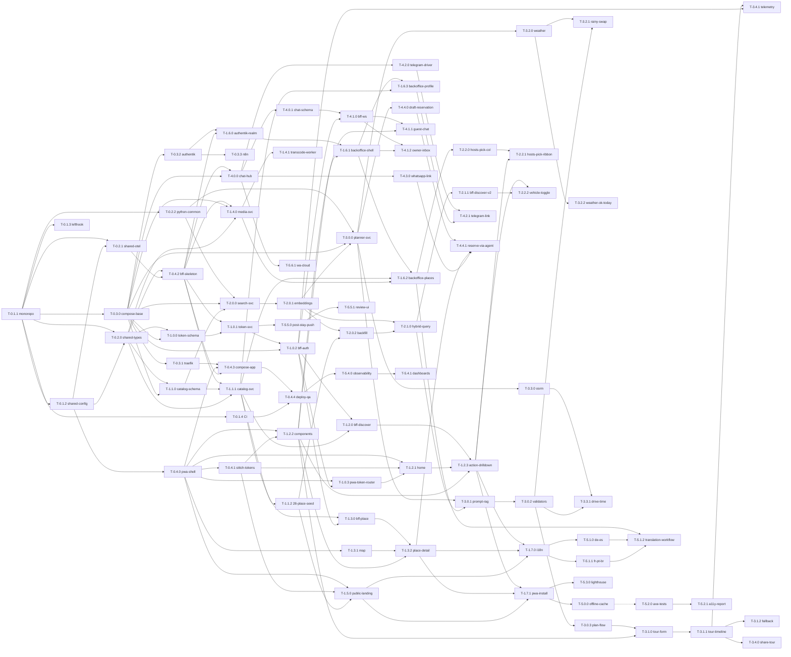

# Plan 001 — TODO

> Phase → Slice → Task hierarchy. Each task is sized for a single Sonnet cs-agent run (~30–90 min). All tasks include hard `deps:`, safe `parallel-with:`, downstream `blocks:`, and `owns:` file scopes so the orchestrator can verify non-overlap before launching.
>
> **Status legend**: ⬜ not started · 🟢 ready (deps met) · 🟡 in progress · ✅ done · 🔒 blocked
>
> When a task completes, tick its box, add `> **Resolved 2026-MM-DD via PR #NN.**` underneath, and append a row in [`EXECUTION.md`](./EXECUTION.md).

---

## Progress Summary

| Phase                           | Slices | Tasks   | Done   | In Progress | Ready | Blocked |
| ------------------------------- | ------ | ------- | ------ | ----------- | ----- | ------- |
| 0 — Foundation                  | 4      | 16      | 15     | 0           | 0     | 1       |
| 1 — Guest Landing & Catalog v1  | 7      | 25      | 2      | 0           | 1     | 22      |
| 2 — Discovery & Search          | 4      | 11      | 0      | 0           | 0     | 11      |
| 3 — Daily Tour Planner          | 5      | 16      | 0      | 0           | 0     | 16      |
| 4 — Chat & Reservation Drafting | 5      | 15      | 0      | 0           | 0     | 15      |
| 5 — Hardening & Growth          | 6      | 17      | 0      | 0           | 0     | 17      |
| **Total**                       | **31** | **100** | **17** | **0**       | **1** | **82**  |

---

## Phase 0 — Foundation

**Phase goal**: empty repo → `docker compose up` runs the full infra stack, PWA shell renders, BFF responds to `/health`, CI is green. No product features.

### Slice 0.1 — Repo skeleton, tooling, CI

#### ✅ T-0.1.1 — Initialise monorepo (pnpm + Turborepo) [opus]

> **Resolved 2026-05-14 via [PR #1](https://github.com/zmeireles/daily-tour/pull/1).** 10 files, +218/−0. Profile: claude-yolo (Opus). cs-agent: `t0-1-1`.

- **owns**: `package.json`, `pnpm-workspace.yaml`, `turbo.json`, `.nvmrc`, `.npmrc`, `pnpm-lock.yaml`, `tsconfig.base.json`, `tsconfig.json`, `.editorconfig`
- **deps**: none
- **blocks**: T-0.1.2, T-0.1.3, T-0.1.4, T-0.2.0, T-0.3.0

#### ✅ T-0.1.2 — Shared TS config + ESLint 9 flat + Prettier 3

> **Resolved 2026-05-14 via [PR #2](https://github.com/zmeireles/daily-tour/pull/2).** 14 files (+2473 / −1, lock-heavy). Profile: claude-sonnet-yolo. cs-agent: `t0-1-2`. Follow-up commit bumped `.nvmrc` to 22.22.3 (eslint-visitor-keys dep) and synced lockfile.

- **owns**: `packages/shared-config/**`, `.prettierrc`, `.prettierignore`
- **deps**: T-0.1.1
- **blocks**: T-0.2.0, every Node service init

#### ✅ T-0.1.3 — Pre-commit (lefthook + gitleaks)

> **Resolved 2026-05-14 via [PR #3](https://github.com/zmeireles/daily-tour/pull/3).** 6 files (+278 / −5 across 2 commits). Profile: claude-sonnet-yolo. Follow-up commit patched hooks to self-source nvm.

- **owns**: `lefthook.yml`, `.gitleaks.toml`, `.gitignore`, `package.json` (additive), `pnpm-lock.yaml`, `.lefthook-local.example.yml`
- **deps**: T-0.1.1
- **blocks**: every later commit (hooks now fire on every push from this repo)

#### ✅ T-0.1.4 — GitHub Actions CI (lint, typecheck, test, audit) [opus]

> **Resolved 2026-05-14 via [PR #4](https://github.com/zmeireles/daily-tour/pull/4).** 6 files (+354 / −2 across 2 commits). Profile: claude-yolo (Opus). Follow-up commit bumped `fetch-depth` to 0 after observing turbo's affected-graph need full git history. **Slice 0.1 complete.**

- **owns**: `.github/workflows/ci.yml`, `.github/workflows/security.yml`, `.github/dependabot.yml` OR `renovate.json`
- **deps**: T-0.1.1
- **parallel-with**: T-0.1.2, T-0.1.3
- **acceptance**:
  - PR workflow runs `turbo run lint typecheck test --filter=...[origin/main]` (affected only).
  - Security workflow runs `pnpm audit --prod`, `trivy` on built images (in later phases), `gitleaks scan`.
  - Renovate config groups patch + security updates with auto-merge after green.

---

### Slice 0.2 — Shared packages & contracts

#### ✅ T-0.2.0 — `packages/shared-types` with zod + ts types scaffold

> **Resolved 2026-05-15 via [PR #5](https://github.com/zmeireles/daily-tour/pull/5).** 29 files (+2606 / −61). Profile: claude-sonnet-yolo. 14 entity zod schemas + 10 enums + i18n helpers + 50 tests. Note: first PR where the Security workflow hit a GitHub backend flake (queued 14m12s, surfaced as "Internal server error"). Re-ran via `gh run rerun` — clean second time.

- **owns**: `packages/shared-types/**`
- **deps**: T-0.1.1, T-0.1.2
- **blocks**: every BFF and service that uses contracts (T-0.3.x, T-1.x.x)
- **acceptance**:
  - Package exports namespaces: `Reservation`, `Place`, `Action`, `Wish`, `Guesthouse`, `OwnerProfile`, `Message`, `TourPlan`, `TokenGrant`.
  - Each namespace exports a zod schema + inferred TS type.
  - Build emits `dist/` consumable by Node + browser.

#### ✅ T-0.2.1 — `packages/shared-otel` (Node OTel SDK helper)

> **Resolved 2026-05-15 via [PR #6](https://github.com/zmeireles/daily-tour/pull/6).** 16 files (+2511 / −259 across 3 commits). Profile: claude-sonnet-yolo. Mid-stream CVE fix bumped OTel 0.57 → 0.218 line; bonus commit aligned local lefthook hooks with CI gates (audit + tests + lint-affected in parallel pre-push).

- **owns**: `packages/shared-otel/**`
- **deps**: T-0.1.1, T-0.1.2
- **parallel-with**: T-0.2.0
- **blocks**: every Node service skeleton
- **acceptance**:
  - Single `initOtel({serviceName, otlpEndpoint})` function.
  - Auto-instruments `http`, `fastify`, `pg`, `amqplib`.
  - Honours `OTEL_EXPORTER_OTLP_ENDPOINT` env.

#### ✅ T-0.2.2 — Python shared `daily_tour_common` package (FastAPI base + pydantic models + otel)

> **Resolved 2026-05-15 via [PR #7](https://github.com/zmeireles/daily-tour/pull/7).** 21 files (+1906 / −0 across 2 commits). Profile: claude-sonnet-yolo. 26 pytest tests pass; ruff clean; mypy strict clean. Orchestrator added the missing README and committed the agent's uncommitted `pydantic[email]` bump. **Slice 0.2 complete (T-0.2.0 + T-0.2.1 + T-0.2.2).**

- **owns**: `services/_python_common/**` OR `packages/python-common/**`
- **deps**: T-0.1.1
- **parallel-with**: T-0.2.0, T-0.2.1
- **blocks**: T-3.0.0 (planner skeleton), T-2.0.0 (search skeleton), T-1.5.0 (ingest skeleton)
- **acceptance**:
  - `pyproject.toml` (PEP 621), `pydantic v2` models mirroring the zod schemas from T-0.2.0 for `Place`, `TourPlan`.
  - `daily_tour_common.app:create_app(service_name)` returns a FastAPI app with `/health`, OTel, CORS configured.
  - `pytest` runs an empty suite green.

---

### Slice 0.3 — Docker Compose infra stack

#### ✅ T-0.3.0 — Compose base: Postgres 17 + pgvector 0.8.2, Redis, RabbitMQ 4.3, MinIO [opus]

> **Resolved 2026-05-15 via [PR #10](https://github.com/zmeireles/daily-tour/pull/10).**

- **owns**: `infra/compose/docker-compose.base.yml`, `infra/postgres/init/00-extensions.sql`, `infra/postgres/init/01-schemas.sql`, `.env.example`
- **deps**: T-0.1.1
- **blocks**: T-0.3.1, T-0.3.2, T-0.3.3, every service that touches DB
- **acceptance**:
  - `docker compose -f infra/compose/docker-compose.base.yml up -d` starts pg/redis/rabbit/minio healthy.
  - Postgres has extensions: `pgvector`, `pg_trgm`, `unaccent`.
  - Schemas pre-created: `catalog`, `chat`, `planner`, `ingest`, `auth_tokens`, `media`, `notif`, `audit`.
  - MinIO buckets pre-created via init job: `media-place`, `media-owner`, `media-tour`.
  - RabbitMQ has `dt.events` topic exchange + dead-letter exchange `dt.dlx`.
  - All exposed ports documented; only RabbitMQ mgmt + MinIO console accessible on host.

#### ✅ T-0.3.1 — Compose overlay: Traefik v3 + ACME staging

> **Resolved 2026-05-15 via [PR #11](https://github.com/zmeireles/daily-tour/pull/11).**

- **owns**: `infra/compose/docker-compose.traefik.yml`, `infra/traefik/**`
- **deps**: T-0.3.0
- **parallel-with**: T-0.3.2, T-0.3.3
- **acceptance**:
  - Traefik routes by docker labels.
  - HTTPS dev via mkcert OR Let's Encrypt staging — pick one and document.
  - Dashboard reachable on `traefik.localhost` behind basic-auth.

#### ✅ T-0.3.2 — Compose overlay: Authentik 2026.2.2+

> **Resolved 2026-05-15 via [PR #12](https://github.com/zmeireles/daily-tour/pull/12).** OIDC provider creation deferred (blueprint failed opaquely on 2026.2.2) — owned by T-1.6.0 at BFF + JWKS integration time. Forward-auth Proxy Provider binding + outpost wiring also deferred to T-1.6.x (or new T-0.3.4) — uncomments middleware in `infra/traefik/dynamic/middlewares.yml`.

- **owns**: `infra/compose/docker-compose.authentik.yml`, `infra/authentik/**`
- **deps**: T-0.3.0, T-0.3.1
- **acceptance**:
  - Authentik comes up, bootstraps an admin via env vars (no manual setup).
  - OIDC provider configured for "owner-app".
  - Behind Traefik with forward-auth middleware definition ready (not yet applied).
  - Never exposed on raw `:9000` — labeled to internal network only.

#### ✅ T-0.3.3 — Compose overlay: n8n ≥1.123.26 (LTS) behind Authentik

> **Resolved 2026-05-15 via [PR #13](https://github.com/zmeireles/daily-tour/pull/13).** Shipped on SQLite for dev; dedicated Postgres deferred to Phase 5 hardening. **Slice 0.3 complete.**

- **owns**: `infra/compose/docker-compose.n8n.yml`, `infra/n8n/**`
- **deps**: T-0.3.0, T-0.3.2
- **acceptance**:
  - n8n container up, version pinned to LTS line.
  - UI reachable only through Traefik with Authentik forward-auth.
  - Persistent volume mounted; backup script documented (cron'd in Phase 5).

---

### Slice 0.4 — PWA shell + BFF skeleton + Stitch tokens

#### ✅ T-0.4.0 — PWA scaffold (Vite 6.4.2 + React 19 + TS + Tailwind v4) [opus]

> **Resolved 2026-05-15 via [PR #14](https://github.com/zmeireles/daily-tour/pull/14).**

- **owns**: `apps/pwa/**` (except `src/locales/`, `src/lib/api/` reserved for later)
- **deps**: T-0.1.1, T-0.1.2
- **blocks**: T-0.4.2, T-1.0.x, T-1.2.x
- **acceptance**:
  - `pnpm dev --filter pwa` opens `http://localhost:5173`, renders "Hello".
  - Tailwind v4 `@theme` block loaded from `src/styles/globals.css`.
  - shadcn/ui CLI initialised; `Button`, `Card` components added as smoke test.
  - `vite-plugin-pwa` installed but configured minimally (manifest stub).
  - Vitest + RTL configured; one trivial passing test.
  - Playwright configured; one trivial passing test.

#### ✅ T-0.4.1 — Stitch MCP design tokens → `@theme` block [opus]

> **Resolved 2026-05-15 via [PR #15](https://github.com/zmeireles/daily-tour/pull/15).** Stitch design system created; mockup generation deferred to per-implementation tasks (T-1.2.1 Home, T-1.3.2 Place Detail, T-3.1.1 Daily Tour, T-4.1.1 Chat). `docs/design/tokens-light.svg` + `tokens-dark.svg` derived artefacts also deferred until mockups land.

- **owns**: `apps/pwa/src/styles/tokens.css`, `apps/pwa/src/styles/globals.css`, `docs/design/**`
- **deps**: T-0.4.0
- **blocks**: T-1.0.x, T-1.2.x
- **acceptance**:
  - Stitch MCP invoked with the palette from [`02-ui-design-system.md §1`](../../exploration/02-ui-design-system.md); design system created.
  - Resulting visual tokens reconciled into `tokens.css` matching the structural-token map in [`02-ui-design-system.md §2`](../../exploration/02-ui-design-system.md).
  - 3–4 hero screen mockups exported into `docs/design/` as reference comps.
  - Dark theme variables under `[data-theme="dark"]` populated.

#### ✅ T-0.4.2 — BFF skeleton (Fastify v5.8.5 on Node 22) [opus]

> **Resolved 2026-05-16 via [PR #17](https://github.com/zmeireles/daily-tour/pull/17).** 22 files (+1271 / −16 across 2 commits). Profile: claude-yolo (Opus). Bundled CVE bump: `@fastify/jwt` `^9.0.0` → `^10.0.0` to patch 4 advisories on `fast-jwt@5.0.6` (3 critical + 1 high) — `@fastify/jwt@10` declares `fast-jwt: ^6.0.2` resolving to patched 6.2.4. Per [auto-merge doctrine](../../operations/auto-merge-doctrine.md), CVE bump escalated to human merge (counter unchanged at 1/3). **Image size 216 MB — 8 % over the <200 MB acceptance target**; tracked as a Phase 0/5 follow-up in [`docs/ai/backlog.md`](../../ai/backlog.md).

- **owns**: `services/bff/**`
- **deps**: T-0.1.1, T-0.1.2, T-0.2.0, T-0.2.1
- **blocks**: T-1.0.1, T-1.2.0
- **acceptance**:
  - `services/bff/` is a pnpm package with TS strict mode.
  - Fastify v5.8.5 starts on `:8080`; `/health` returns `{status: "ok"}`.
  - Plugins wired: `@fastify/helmet`, `@fastify/cors`, `@fastify/rate-limit`, `@fastify/jwt` (with public-key-only mode placeholder).
  - OTel SDK initialised via `shared-otel`.
  - Vitest setup; one smoke test for `/health`.
  - Dockerfile (multi-stage) builds to `<200 MB` image.

#### ✅ T-0.4.3 — Compose overlay: bff + pwa-static (nginx) [opus]

> **Resolved 2026-05-16 via [PR #19](https://github.com/zmeireles/daily-tour/pull/19).** 3 files (+248 / −41). Profile: claude-yolo (Opus). Clean Opus self-commit (`618e2d5`). Two services: `bff` (built from `services/bff/Dockerfile`, repo-root context, `daily-tour/bff:dev` tag) + `pwa-static` (`nginx:1.27-alpine` with read-only bind mounts of `apps/pwa/dist/` and `infra/nginx/pwa.conf`). Both behind Traefik on `api.localhost` / `app.localhost`. **Agent-discovered IPv6/IPv4 mismatch**: BusyBox `wget` prefers IPv6 in both alpine images, but Fastify and the bind-mounted nginx (read-only conf blocks the `listen [::]:80` entrypoint patch) only bind IPv4. Healthchecks pinned to `http://127.0.0.1` instead of `localhost` to fix. Verified locally: 11/11 containers healthy after ~3 min Authentik first-boot, 5 endpoints green (PWA root 200, SPA fallback 200, /healthz 200, BFF /health JSON ok, CORS preflight 204), gitleaks clean (52 commits). **Slice 0.4 closes — Phase 0 complete (modulo deferred T-0.4.4).**

- **owns**: `infra/compose/docker-compose.app.yml`
- **deps**: T-0.3.1, T-0.4.0, T-0.4.2
- **blocks**: T-0.4.4
- **acceptance**:
  - `pnpm build && docker compose up app` serves PWA via nginx behind Traefik on `app.localhost`, BFF on `api.localhost`.
  - Hot-reload dev flow documented: `pnpm dev` for PWA + BFF natively, Compose runs the rest.

#### 🔒 T-0.4.4 — End-to-end smoke + CI deploy gate to QA VPS [opus] — **BLOCKED: QA VPS not yet acquired**

- **owns**: `.github/workflows/deploy-qa.yml`, `scripts/deploy.sh`
- **deps**: T-0.4.3, T-0.1.4
- **blocked-on**: infra acquisition (Ubuntu 24 QA VPS per `IDEA.md` "Architecture > Generic"). Track in [`docs/ai/backlog.md`](../../ai/backlog.md). Resume this task once host + SSH key + DNS are ready.
- **acceptance**:
  - On push to `main` with `[deploy-qa]` in commit msg OR `workflow_dispatch`, CI builds + pushes images to GHCR + SSH-deploys to QA VPS.
  - Healthchecks must pass; rollback on failure.
  - Log entry appended to `DEPLOYS.md` automatically (or instructions documented).

**Phase 0 exit gate (local-only)**: `docker compose up` runs full stack locally; PWA shell + BFF `/health` reachable; CI green. The QA-deploy step (T-0.4.4) is deferred until the VPS is acquired and does not block Phase 0 exit.

---

## Phase 1 — Guest Landing & Catalog v1

**Phase goal**: a tokened guest opens the URL → 6-action grid → drills into Eat → opens a place detail with map + Call/Navigate/Draft-DM actions. Tokenless visitor sees public landing. Owner CRUDs places via Authentik-gated backoffice. en + pt-PT.

### Slice 1.0 — Reservation token & access (FR-AC-01..05)

#### ✅ T-1.0.0 — Drizzle schema: `auth_tokens.reservation`, `auth_tokens.guest`, `auth_tokens.token_grant`

> **Resolved 2026-05-16 via [PR #22](https://github.com/zmeireles/daily-tour/pull/22).** 14 files (+~1450 / −0). Profile: claude-sonnet-yolo. Three commits on the branch: agent's clean self-commit (`f621009`) + orchestrator fix-ups for port-remap + idempotency (`92e445b`) and drizzle-orm `^0.36` → `^0.45.2` CVE bump (`d2bf70a`, GHSA-gpj5-g38j-94v9 HIGH "SQL injection via improperly escaped SQL identifiers"). 10-point migration SQL review all green: 3 tables + 7 indexes + 6 check constraints + 2 FKs (RESTRICT on guest, CASCADE on token_grant), schema column-pin matches `shared-types` zod exactly, `auth_tokens` schema NOT re-CREATEd (hand-stripped per drizzle-kit gotcha; comment added to SQL header explaining the strip needs to be re-applied after every `db:generate`). Verified on the new infra (postgres on 27432): migration applies cleanly, seed runs idempotently (2 guests + 2 reservations with fixed UUIDs across runs), pnpm audit clean, lint + typecheck green. Per [doctrine](../../operations/auto-merge-doctrine.md), schema migrations always escalate to human review — counter unchanged on merge. **Note**: file is `drizzle/migrations/0000_init.sql` (drizzle-kit's 0-indexed naming) rather than the TODO's hypothetical `0001_init.sql`.

- **owns**: `services/token-svc/src/db/schema.ts`, `services/token-svc/drizzle/migrations/0000_init.sql`
- **deps**: T-0.2.0, T-0.3.0
- **blocks**: T-1.0.1, T-1.0.2
- **acceptance**:
  - Tables created in `auth_tokens` schema; geom and timestamp columns proper types.
  - Drizzle migration generated, not pushed; SQL hand-reviewed for safety.
  - Seed script loads 1 guesthouse + 2 reservations + 2 guests for dev.

#### ✅ T-1.0.1 — `token-svc` Fastify service: issue / revoke / exchange endpoints

> **Resolved 2026-05-16 via [PR #24](https://github.com/zmeireles/daily-tour/pull/24).** 18 files (+~1300 / −15 across 4 commits). Profile: claude-yolo (Opus). **Recovery cycle**: agent crashed at ~40% via cs-agent's autocommit-fallback closer; foundational layer (config, db/client, instrumentation, opaque-token lib, jwt lib, version, package.json deps) committed as `3d253f4` + `031590d`. Orchestrator wrote the remaining ~60% manually following [`temp/prompt-t-1.0.1.md`](../../../temp/prompt-t-1.0.1.md), shipped as `802278f` + `be77dce`. **3 endpoints + health** (POST issue, GET exchange, DELETE revoke) with the full JWT contract (`sub=guest_id`, `rid`, `gh`, `locale`, `jti=sha256(opaque)`, `exp=min(checkout+24h, now+1h)`, HS256). **10/10 vitest cases pass** (Testcontainers-pg on pgvector/pgvector:pg17). **Custom migrator** replaces drizzle-orm's bundled one — drizzle unconditionally emits `CREATE SCHEMA IF NOT EXISTS` for both data + tracking schemas which requires DB-level CREATE; token_svc intentionally lacks that per the least-privilege architecture. ~50 lines, routes tracking into `auth_tokens.__drizzle_migrations`. **Log redaction** via pino serializer: opaque token never lands in logs (D15). Docker image 227 MB. Per [doctrine](../../operations/auto-merge-doctrine.md), schema migrations on boot + cryptographic primitives both escalate — human-merged, counter unchanged.

- **owns**: `services/token-svc/**` (except `src/db/schema.ts` from T-1.0.0)
- **deps**: T-0.4.2, T-1.0.0
- **blocks**: T-1.0.2
- **acceptance**:
  - `POST /v1/reservations/:id/token` → returns opaque short token, persists `token_grant`.
  - `GET /v1/tokens/:opaque/exchange` → returns JWT (`sub`, `rid`, `gh`, `locale`, `exp` = min(checkout+24h, now+1h)).
  - `DELETE /v1/tokens/:jti` revokes.
  - Vitest: happy path + expired + revoked + invalid.
  - Listens on `:8088`.

#### 🟢 T-1.0.2 — BFF token-exchange middleware + Redis JTI cache

- **owns**: `services/bff/src/plugins/auth.ts`, `services/bff/src/lib/redis.ts`
- **deps**: T-1.0.1, T-0.3.0
- **blocks**: T-1.2.0
- **acceptance**:
  - First-load `GET /r/:token` exchanges via token-svc, sets `dt_refresh` HttpOnly cookie, returns 200 + JWT in JSON.
  - Subsequent JWT-bearing requests check `jti` against Redis cache (1-min TTL on misses).
  - Revoked `jti` returns 401 within 1 minute of revocation.
  - Public routes opt-out via `route.config.auth = 'public'`.
  - Integration test uses Testcontainers for Postgres + Redis.

#### ⬜ T-1.0.3 — PWA: token-URL router + auth state (Zustand)

- **owns**: `apps/pwa/src/routes/r.$token.tsx`, `apps/pwa/src/lib/auth/**`, `apps/pwa/src/store/session.ts`
- **deps**: T-0.4.0, T-1.0.2
- **blocks**: T-1.2.0
- **acceptance**:
  - `/r/:token` route consumes token, calls BFF exchange, stores JWT in memory.
  - Zustand `useSession()` exposes `{jwt, reservation, guesthouse, locale}`.
  - Token never persisted to localStorage; refresh cookie handles re-issue.
  - Token expired → graceful redirect to `/` with toast.
  - Vitest covers the success + expired + invalid cases.

---

### Slice 1.1 — Catalog data model + 28-place seed (FR-CAT-01..04)

#### ⬜ T-1.1.0 — Drizzle schema: catalog.\* tables + actions/wishes seed

- **owns**: `services/catalog-svc/src/db/schema.ts`, `services/catalog-svc/drizzle/migrations/0001_init.sql`, `services/catalog-svc/seeds/actions-wishes.sql`
- **deps**: T-0.2.0, T-0.3.0
- **blocks**: T-1.1.1, T-1.1.2
- **acceptance**:
  - Tables in `catalog` schema: `guesthouse`, `owner_profile`, `place`, `action`, `wish`, `place_action_wish`, `place_media`, `place_candidate`.
  - PostGIS not required; geometry via `point` type from earthdistance OR pgvector — pick one.
  - 6 actions + ~30 wishes seeded per [`05-tourism-domain.md §3`](../../exploration/05-tourism-domain.md).

#### ⬜ T-1.1.1 — `catalog-svc` Fastify CRUD: places, guesthouses, owner-profile

- **owns**: `services/catalog-svc/**` (except `src/db/schema.ts` from T-1.1.0)
- **deps**: T-0.4.2, T-1.1.0, T-0.2.0
- **blocks**: T-1.1.2, T-1.2.0, T-1.3.0
- **acceptance**:
  - REST endpoints (all under `/v1`): `GET /places`, `GET /places/:id`, `POST /places`, `PATCH /places/:id`, `DELETE /places/:id`, plus equivalents for guesthouse and owner-profile.
  - i18n fields stored as `jsonb` keyed by locale.
  - Soft-delete (`status='archived'`) on DELETE.
  - Vitest integration tests w/ Testcontainers.
  - Listens on `:8081`.

#### ⬜ T-1.1.2 — 28-place seed fixture loader

- **owns**: `services/catalog-svc/seeds/places-sao-miguel.sql`, `services/catalog-svc/seeds/load.ts`
- **deps**: T-1.1.0, T-1.1.1
- **blocks**: T-1.2.1, every later place-aware task
- **acceptance**:
  - All 28 places from [`05-tourism-domain.md §2`](../../exploration/05-tourism-domain.md) loaded with action+wish tags, EN + pt-PT description placeholders, hours where known, geom, status=`published`.
  - Hero photo URLs reference seeded MinIO objects (or stable Unsplash for dev — flagged for replacement).
  - `pnpm --filter catalog-svc seed` is idempotent.

---

### Slice 1.2 — PWA Home + Action drill-down list (FR-DSC-01..05, FR-PUB)

#### ⬜ T-1.2.0 — BFF aggregator: `GET /v1/discover?action=<>&loc=...&km=...`

- **owns**: `services/bff/src/routes/discover.ts`, `services/bff/src/lib/catalog-client.ts`
- **deps**: T-1.0.2, T-1.1.1
- **blocks**: T-1.2.1
- **acceptance**:
  - Query params validated by zod from `shared-types`.
  - Filters by action; geo-filters by haversine; returns top 30 grouped by wish.
  - Response hydrates place card payload (signed media URLs via T-1.4.x or stable Unsplash placeholder in Phase 1).
  - p95 < 300 ms with 28-place seed.

#### ⬜ T-1.2.1 — PWA: Home with 6 Action tiles + locale-auto + theme-auto

- **owns**: `apps/pwa/src/routes/_authed.index.tsx`, `apps/pwa/src/features/home/**`, `apps/pwa/src/lib/theme/**`, `apps/pwa/src/lib/locale/**`
- **deps**: T-0.4.0, T-0.4.1, T-1.0.3
- **parallel-with**: T-1.2.2
- **blocks**: T-1.2.3
- **acceptance**:
  - 3×2 grid of Action tiles (icons + EN/pt-PT labels).
  - Greeting by guest name (from token claims).
  - Theme auto via `suncalc` against São Miguel lat/long; manual override in settings.
  - Locale auto from token; locale switcher in header overflow.
  - "Plan my day" + "Message João" entries below the fold (stubbed routes for now).

#### ⬜ T-1.2.2 — PWA: PlaceCard + ActionGroupHeader + LocationToggle + RangeSlider components

- **owns**: `apps/pwa/src/components/place-card.tsx`, `apps/pwa/src/components/action-group-header.tsx`, `apps/pwa/src/components/location-toggle.tsx`, `apps/pwa/src/components/range-slider.tsx`, `apps/pwa/src/components/__tests__/**`
- **deps**: T-0.4.0, T-0.4.1
- **parallel-with**: T-1.2.1
- **blocks**: T-1.2.3
- **acceptance**:
  - Each component matches the spec in [`02-ui-design-system.md §5`](../../exploration/02-ui-design-system.md).
  - Storybook NOT required yet (deferred); RTL + a11y tests are.
  - PlaceCard renders distance pill + action chips.
  - RangeSlider supports discrete steps `[1,3,5,10,25]`, debounced 250 ms.

#### ⬜ T-1.2.3 — PWA: Action drill-down route (`/a/:action`) with grouped-by-wish list

- **owns**: `apps/pwa/src/routes/_authed.a.$action.tsx`, `apps/pwa/src/features/discover/**`
- **deps**: T-1.2.0, T-1.2.1, T-1.2.2
- **blocks**: T-1.3.0
- **acceptance**:
  - Renders list grouped by wish using `ActionGroupHeader`.
  - Location toggle + range slider working; refetches via TanStack Query.
  - Default sort = distance from active location.
  - Sort menu (Distance / Rating / Name) + group-toggle (Grouped / Flat) functional.
  - List virtualisation for ≥30 items.
  - Playwright e2e: token landing → tap Eat → see grouped list.

---

### Slice 1.3 — Place Detail page (FR-PDT-01..04)

#### ⬜ T-1.3.0 — BFF: `GET /v1/places/:id` hydrated payload

- **owns**: `services/bff/src/routes/places.ts`
- **deps**: T-1.1.1, T-1.0.2
- **blocks**: T-1.3.2
- **acceptance**:
  - Returns place + media + actions + wishes + i18n description + computed `weather_ok_today` boolean (stubbed `true` in Phase 1; real IPMA call in Phase 3).
  - p95 < 200 ms.

#### ⬜ T-1.3.1 — PWA: Map setup (MapLibre GL JS + PMTiles + custom MapPin)

- **owns**: `apps/pwa/src/lib/map/**`, `apps/pwa/src/components/map-pin.tsx`, `apps/pwa/src/components/map-view.tsx`
- **deps**: T-0.4.0
- **parallel-with**: T-1.3.0
- **blocks**: T-1.3.2
- **acceptance**:
  - MapLibre 5.24 + PMTiles 4 loaded; OSM tile style; PMTiles file path configurable.
  - `MapPin` custom SVG (basalt teardrop + tea-green dot + selected ring) per [`02 §5`](../../exploration/02-ui-design-system.md).
  - `MapView` accepts `{center, zoom, pins[]}`; `prefers-reduced-motion` disables fly-to.

#### ⬜ T-1.3.2 — PWA: Place Detail route (`/p/:id`) with gallery + map + actions

- **owns**: `apps/pwa/src/routes/_authed.p.$id.tsx`, `apps/pwa/src/features/place-detail/**`
- **deps**: T-1.3.0, T-1.3.1, T-1.2.2
- **blocks**: T-1.7.0 (smoke test)
- **acceptance**:
  - Hero + embla carousel gallery.
  - i18n description with per-field fallback indicator.
  - Map centered on place with single pin.
  - Action row: Navigate (deep-link `geo:` / `https://maps.apple.com/?q=`), Call (`tel:`), Draft DM (`wa.me` link with locale-aware prefilled text).
  - Playwright: token landing → Eat → place → tap Call (intercepts the navigation).

---

### Slice 1.4 — Media service + MinIO upload pipeline (supports FR-CAT-02, FR-PDT)

#### ⬜ T-1.4.0 — `media-svc` Fastify: pre-signed PUT + GET + asset registry

- **owns**: `services/media-svc/**`
- **deps**: T-0.4.2, T-0.3.0, T-0.2.0
- **blocks**: T-1.6.2 (backoffice media upload)
- **acceptance**:
  - `POST /v1/uploads/sign` → returns `{put_url, asset_id}` scoped to owner.
  - `GET /v1/assets/:id` → 302 to pre-signed GET URL (15-min TTL).
  - Stores rows in `media` schema.
  - Max file size + MIME whitelist enforced (jpeg/webp/mp4).
  - Listens on `:8087`.

#### ⬜ T-1.4.1 — Image transcode worker (sharp → multiple sizes + AVIF/WebP)

- **owns**: `services/media-svc/src/workers/transcode.ts`
- **deps**: T-1.4.0
- **acceptance**:
  - Consumer on RabbitMQ `media.uploaded` queue.
  - Generates `200w`, `600w`, `1200w` variants in AVIF + WebP, stores back in MinIO under `derived/`.
  - Updates `media_asset.variants` jsonb.

---

### Slice 1.5 — Public landing (FR-PUB-01..03)

#### ⬜ T-1.5.0 — PWA: Public landing route `/`

- **owns**: `apps/pwa/src/routes/index.tsx`, `apps/pwa/src/features/public-landing/**`
- **deps**: T-0.4.0, T-0.4.1, T-1.1.2 (to render sample places)
- **acceptance**:
  - Renders hero, 3-line owner pitch, sample places (read-only — no distance unless `navigator.geolocation` succeeds in foreground).
  - "Check availability" CTA opens `mailto:` (configurable).
  - Locale switcher functional.
  - Premium-only surfaces (chat, tour, agent) hidden.
  - Playwright: bare-domain visit renders public surface without any premium elements.

---

### Slice 1.6 — Owner backoffice MVP (FR-BO-01..03)

#### ⬜ T-1.6.0 — Authentik realm + OIDC provider for owner-app [opus]

- **owns**: `infra/authentik/exports/owner-app-realm.yaml`, `services/bff/src/plugins/authentik.ts`
- **deps**: T-0.3.2, T-0.4.2
- **blocks**: T-1.6.1
- **acceptance**:
  - Authentik exports the realm config as a versionable blueprint.
  - BFF `@fastify/jwt` plugin configured with Authentik JWKS endpoint for the `staff` audience.
  - `route.config.auth = 'owner'` middleware enforces the audience.

#### ⬜ T-1.6.1 — PWA: Backoffice shell at `/admin` (Authentik-protected)

- **owns**: `apps/pwa/src/routes/admin.tsx`, `apps/pwa/src/routes/admin.**`, `apps/pwa/src/features/backoffice/**`
- **deps**: T-1.6.0, T-1.2.2
- **blocks**: T-1.6.2, T-1.6.3
- **acceptance**:
  - Hits `/admin` redirect to Authentik login if no session; back to dashboard on success.
  - Dashboard shell with nav: Guesthouses, Places, Reservations, Profile.

#### ⬜ T-1.6.2 — Backoffice: Place CRUD with media upload

- **owns**: `apps/pwa/src/features/backoffice/places/**`
- **deps**: T-1.6.1, T-1.1.1, T-1.4.0
- **acceptance**:
  - List, create, edit, archive place.
  - Hero + gallery upload via pre-signed PUT to `media-svc`.
  - Action + wish multi-select with the seeded taxonomy.
  - i18n fields (EN + pt-PT) entered as separate tabs.

#### ⬜ T-1.6.3 — Backoffice: Owner profile + Guesthouse CRUD

- **owns**: `apps/pwa/src/features/backoffice/profile/**`, `apps/pwa/src/features/backoffice/guesthouses/**`
- **deps**: T-1.6.1, T-1.1.1
- **parallel-with**: T-1.6.2
- **acceptance**:
  - Edit owner bio, photo, phone (with `call_enabled` toggle), preferred DM channels.
  - Guesthouse CRUD includes geom (lat/long picker from MapLibre).

---

### Slice 1.7 — i18n + theme + PWA install (FR-XC-01..04)

#### ⬜ T-1.7.0 — i18n bundles + namespaces (en, pt-PT)

- **owns**: `apps/pwa/src/locales/en/**`, `apps/pwa/src/locales/pt-PT/**`, `apps/pwa/src/lib/i18n/**`
- **deps**: T-1.2.3, T-1.3.2, T-1.5.0
- **acceptance**:
  - react-i18next 15 set up with `i18next-browser-languagedetector` and namespace lazy-loading.
  - Namespaces: `common`, `home`, `discover`, `place`, `public`, `admin`.
  - All UI strings extracted; no hardcoded text remains.
  - Translation files validated by a CI check (no missing keys per locale).

#### ⬜ T-1.7.1 — PWA install + service worker + offline shell (Workbox `generateSW`)

- **owns**: `apps/pwa/vite.config.ts` (PWA config block), `apps/pwa/public/manifest.webmanifest`, `apps/pwa/src/lib/pwa/**`
- **deps**: T-1.2.3, T-1.3.2, T-1.5.0
- **acceptance**:
  - PWA manifest + icons + `theme_color` from tokens.
  - Service worker precaches app shell + critical CSS + main bundle.
  - "Add to Home Screen" custom prompt on 2nd visit.
  - Lighthouse PWA score ≥ 90 locally.

---

**Phase 1 exit gate**: a tokened guest can land → drill into Eat by Wish → open place detail → tap Call/Navigate/Draft-DM. Tokenless visitor sees public landing. Owner CRUDs places via Authentik-gated backoffice. EN + pt-PT.

---

## Phase 2 — Discovery & Search

**Phase goal**: lists rank by hybrid geo + semantic similarity (pgvector). Host's picks ribbon. Vehicle-aware toggle. Range slider + location toggle wired to live re-rank.

### Slice 2.0 — Embedding pipeline & pgvector store (FR-DSC-06)

#### ⬜ T-2.0.0 — `search-svc` skeleton (FastAPI 0.136 + SQLAlchemy 2 async) [opus]

- **owns**: `services/search-svc/**`
- **deps**: T-0.2.2, T-0.3.0, T-1.1.0
- **blocks**: T-2.0.1, T-2.1.0
- **acceptance**:
  - FastAPI app on `:8082`, `/health` ok.
  - SQLAlchemy reads `catalog.place` (read-only via dedicated DB role).
  - Listens to RabbitMQ for `place.published` / `place.approved`.

#### ⬜ T-2.0.1 — Embeddings: `catalog.place_embedding` table + worker (Anthropic/OpenAI embedding model)

- **owns**: `services/search-svc/src/embeddings/**`, `services/search-svc/alembic/versions/0001_place_embedding.py`
- **deps**: T-2.0.0
- **blocks**: T-2.1.0
- **acceptance**:
  - Schema: `place_embedding(place_id, vec vector(1024), model_version, embedded_at)`.
  - Worker reads `place.published` events; computes embedding from `name + description + action/wish tags + neighborhood`; upserts row.
  - HNSW index built; query helper `top_k(text, k)` returns ranked place IDs.

#### ⬜ T-2.0.2 — Backfill: embed all 28 seeded places

- **owns**: `services/search-svc/scripts/backfill.py`
- **deps**: T-2.0.1, T-1.1.2
- **acceptance**:
  - One-shot script enqueues `place.published` for every active place; worker processes all 28.
  - Idempotent; safe to re-run.

---

### Slice 2.1 — Hybrid query endpoint (FR-DSC-02, FR-DSC-06)

#### ⬜ T-2.1.0 — `search-svc` `/query` endpoint: SQL geo + tag filter ∩ vector re-rank

- **owns**: `services/search-svc/src/api/query.py`
- **deps**: T-2.0.1, T-2.0.2
- **blocks**: T-2.1.1
- **acceptance**:
  - POST `/v1/query` with `{action, wish?, loc, km, free_text?}`.
  - Step 1: SQL filter on action/wish + haversine within `km`.
  - Step 2: re-rank by cosine sim against `free_text` (or wish slug if free_text empty).
  - Returns ranked place IDs + scores.
  - p95 < 250 ms for 28-place catalog (target 100 ms on larger).

#### ⬜ T-2.1.1 — BFF `/v1/discover` switches from naive sort to search-svc hybrid

- **owns**: `services/bff/src/routes/discover.ts`
- **deps**: T-2.1.0
- **acceptance**:
  - BFF calls search-svc for ranking; hydrates from catalog-svc; preserves response shape.
  - Backward-compatible with PWA from Phase 1 (no PWA changes needed yet).

---

### Slice 2.2 — UX: Host's picks + vehicle toggle (FR-DSC-07, FR-DSC-08)

#### ⬜ T-2.2.0 — Catalog: `place.is_hosts_pick` column + backoffice toggle

- **owns**: `services/catalog-svc/drizzle/migrations/0002_hosts_pick.sql`, `services/catalog-svc/src/routes/places.ts` (additive), `apps/pwa/src/features/backoffice/places/**` (additive — flag pickers ONLY; do not touch other backoffice files)
- **deps**: T-1.6.2
- **blocks**: T-2.2.1
- **acceptance**:
  - Boolean column added; capped at 5 per guesthouse (DB constraint OR app check).
  - Backoffice has a toggle on the place edit form.

#### ⬜ T-2.2.1 — PWA: Host's picks ribbon at the top of grouped lists

- **owns**: `apps/pwa/src/features/discover/hosts-picks-ribbon.tsx`, `apps/pwa/src/routes/_authed.a.$action.tsx` (additive only)
- **deps**: T-2.2.0, T-1.2.3
- **acceptance**:
  - Renders above algorithmic groups when ≥1 host's pick matches the current action.
  - Distinct visual treatment (per [`02-ui-design-system.md`](../../exploration/02-ui-design-system.md) — use a subtle tea-green border + "Host's pick" badge).

#### ⬜ T-2.2.2 — PWA: Vehicle-aware toggle + filter

- **owns**: `apps/pwa/src/store/preferences.ts`, `apps/pwa/src/features/discover/vehicle-toggle.tsx`, `apps/pwa/src/routes/_authed.a.$action.tsx` (additive)
- **deps**: T-1.2.3, T-2.1.1
- **acceptance**:
  - Toggle in discover header (`Car` ⇄ `No car`).
  - "No car" passes `vehicle=none` to BFF; search-svc filters out places > 1 km from public-transport/walking-friendly route (heuristic; flagged as v1 approximation).

---

**Phase 2 exit gate**: a free-text wish (e.g., "romantic dinner near the sea") finds the right places via vector re-rank; host's picks float to the top; vehicle toggle filters appropriately.

---

## Phase 3 — Daily Tour Planner

**Phase goal**: a guest fills a form + voice note → planner emits a validated multi-stop timeline with realistic drive times, weather-aware fallbacks, and lock/swap/regenerate edits.

### Slice 3.0 — Planner service skeleton + RAG (FR-TUR-01..07)

#### ⬜ T-3.0.0 — `planner-svc` skeleton (FastAPI + Anthropic SDK + OpenAI SDK) [opus]

- **owns**: `services/planner-svc/**`
- **deps**: T-0.2.2, T-0.3.0, T-2.0.1
- **blocks**: T-3.0.1
- **acceptance**:
  - FastAPI on `:8083`, `/health`.
  - LLM client wraps both Anthropic + OpenAI SDKs via a single `LLMClient.complete(prompt, schema)` API.
  - Per-request cost logged to `planner.llm_call_log` table.

#### ⬜ T-3.0.1 — Prompt assembler + RAG retrieval (uses search-svc) [opus]

- **owns**: `services/planner-svc/src/prompt/**`, `services/planner-svc/src/rag.py`
- **deps**: T-3.0.0, T-2.1.0
- **blocks**: T-3.0.2
- **acceptance**:
  - For each slot (breakfast/morning/lunch/afternoon/dinner), retrieve top-K candidates via search-svc.
  - System prompt: Azores context, opening hours, locale, no fabrication. Guest free-text wrapped in `<guest>` delimited block.
  - Structured-output JSON schema enforced.

#### ⬜ T-3.0.2 — Server-side validators: place_id provenance + travel-time sanity [opus]

- **owns**: `services/planner-svc/src/validators/**`
- **deps**: T-3.0.1
- **blocks**: T-3.0.3
- **acceptance**:
  - Reject any `place_id` not in the retrieval set.
  - Compute pairwise travel time via OSRM (self-hosted OR public API) and reject infeasible legs.
  - Force lunch into 12:30–14:30 window unless free-text overrides.
  - Unit tests cover hallucination rejection and travel-time bound rejection.

#### ⬜ T-3.0.3 — `POST /v1/tour-plans` async flow with RabbitMQ `tour.requested/completed` [opus]

- **owns**: `services/planner-svc/src/api/plans.py`, `services/bff/src/routes/tour-plans.ts`, `services/planner-svc/src/workers/plan_worker.py`
- **deps**: T-3.0.2
- **blocks**: T-3.1.0
- **acceptance**:
  - BFF accepts request, validates with zod, publishes `tour.requested`, returns `202 + plan_id`.
  - Worker consumes, runs RAG + LLM + validators, persists `planner.tour_plan` + `planner.tour_step`.
  - Emits `tour.completed`; BFF pushes WS event to subscribed client.

---

### Slice 3.1 — PWA Daily Tour UI

#### ⬜ T-3.1.0 — PWA: Daily Tour form + voice input (FR-TUR-01)

- **owns**: `apps/pwa/src/routes/_authed.tour.tsx`, `apps/pwa/src/features/tour/form/**`, `apps/pwa/src/components/voice-input-button.tsx`
- **deps**: T-3.0.3, T-1.2.2
- **blocks**: T-3.1.1
- **acceptance**:
  - Form: date, start/end, party size (pre-filled from token), vehicle (from preferences), notes (text + voice toggle).
  - Web Speech API native — feature-detected; text-only fallback.
  - Submit returns plan ID; WS subscribes for status.

#### ⬜ T-3.1.1 — PWA: DailyTourTimeline component (FR-TUR-02, FR-TUR-06)

- **owns**: `apps/pwa/src/components/daily-tour-timeline.tsx`, `apps/pwa/src/features/tour/timeline/**`
- **deps**: T-3.1.0
- **blocks**: T-3.1.2
- **acceptance**:
  - Vertical timeline per [`02-ui-design-system.md §5`](../../exploration/02-ui-design-system.md).
  - Per-stop actions: Swap (re-rank from retrieval set), Remove, Lock.
  - Global: Regenerate (preserve locks), Save, Share.
  - Streamed status: pending → retrieving → planning → validating → done.

#### ⬜ T-3.1.2 — PWA: Daily Tour failure fallback (FR-TUR-08)

- **owns**: `apps/pwa/src/features/tour/fallback.tsx`
- **deps**: T-3.1.1
- **acceptance**:
  - On planner error or empty plan, render 3 default stops near guesthouse (closest 3 "Host's picks" or top-3 published places).
  - Visible "Try again" button.

---

### Slice 3.2 — Weather-aware planning (FR-TUR-05, FR-PDT-07)

#### ⬜ T-3.2.0 — IPMA Azores forecast client + cache

- **owns**: `services/planner-svc/src/weather.py`, `services/planner-svc/src/cache.py`
- **deps**: T-3.0.0
- **blocks**: T-3.2.1, T-3.2.2
- **acceptance**:
  - Polls IPMA API for São Miguel daily/hourly; caches in Redis with 30-min TTL.
  - Helper `is_rainy(loc, when) -> bool`.

#### ⬜ T-3.2.1 — Planner: rainy-slot swap to indoor pool

- **owns**: `services/planner-svc/src/validators/weather.py`, `services/planner-svc/src/prompt/**` (additive)
- **deps**: T-3.2.0, T-3.0.2
- **acceptance**:
  - If `is_rainy(loc, slot)` returns true, restrict retrieval to `rainy-day-OK` tagged places for that slot.
  - Validator rejects outdoor-only places in rainy slots; planner retries with restricted set.

#### ⬜ T-3.2.2 — BFF: `weather_ok_today` enrichment on `/v1/places/:id`

- **owns**: `services/bff/src/routes/places.ts` (additive)
- **deps**: T-3.2.0
- **acceptance**:
  - Outdoor-tagged places carry `weather_ok_today` boolean computed from IPMA.
  - PWA place-detail uses it (no PWA change required; flag already in T-1.3.2 stub).

---

### Slice 3.3 — Drive-time & OSRM (FR-TUR-04)

#### ⬜ T-3.3.0 — OSRM Compose overlay OR Distance Matrix client

- **owns**: `infra/compose/docker-compose.osrm.yml` OR `services/planner-svc/src/distance.py`
- **deps**: T-0.3.0 OR T-3.0.0
- **acceptance**:
  - OSRM running locally with São Miguel OSM extract (driving profile), OR `GoogleDistanceMatrixClient` with API-key config.
  - Helper `route(a, b) -> {km, duration_min}`.

#### ⬜ T-3.3.1 — Planner validator uses real drive times

- **owns**: `services/planner-svc/src/validators/travel.py`
- **deps**: T-3.3.0, T-3.0.2
- **acceptance**:
  - Pairwise legs computed; reject plans where total > window OR any leg > 120 min.
  - Cache leg results in Redis (key: pair of place_ids).

---

### Slice 3.4 — Share & telemetry (FR-TUR-09, FR-TUR-10)

#### ⬜ T-3.4.0 — PWA: Share tour link (token-stripped)

- **owns**: `apps/pwa/src/features/tour/share.tsx`, `services/bff/src/routes/tour-plans.ts` (additive)
- **deps**: T-3.1.1
- **acceptance**:
  - "Share" generates an opaque short link via BFF; recipient sees a read-only tour view (no token, no chat, no per-guest data).
  - PDF export (client-side `html2pdf` or similar) for car-dashboard print.

#### ⬜ T-3.4.1 — Telemetry: "started stop" event + analytics table

- **owns**: `services/bff/src/routes/telemetry.ts`, `services/catalog-svc/drizzle/migrations/0003_telemetry.sql` OR a dedicated `audit.telemetry` table
- **deps**: T-3.1.1, T-1.0.2
- **acceptance**:
  - PWA emits an event when a stop is opened in maps OR phone-called.
  - Aggregated for Phase 5 dashboards.

---

**Phase 3 exit gate**: guest generates a Daily Tour, validators reject hallucinations, drive times are realistic, rainy slots swap to indoor places, plan can be locked/swapped/regenerated/saved/shared.

---

## Phase 4 — Chat & Reservation Drafting

**Phase goal**: in-app WebSocket chat between guest and owner; Telegram driver works; WhatsApp `wa.me` deep-link substitutes for full Business API; AI drafts a localised reservation DM.

### Slice 4.0 — chat-hub skeleton + driver interface (FR-CHT-01)

#### ⬜ T-4.0.0 — `chat-hub` Fastify service skeleton with driver interface [opus]

- **owns**: `services/chat-hub/**`
- **deps**: T-0.4.2, T-0.3.0
- **blocks**: T-4.0.1, T-4.1.0
- **acceptance**:
  - Fastify on `:8085`.
  - Driver interface: `send(channel, thread, message)`, `receive_webhook(channel, payload)`, `normalize(payload) -> Message`.
  - In-memory driver registered for in-app channel.

#### ⬜ T-4.0.1 — Schemas: `chat.chat_thread`, `chat.message`, `chat.channel_binding`

- **owns**: `services/chat-hub/src/db/schema.ts`, `services/chat-hub/drizzle/migrations/0001_init.sql`
- **deps**: T-4.0.0
- **blocks**: T-4.1.0
- **acceptance**:
  - Tables created; FKs to `auth_tokens.reservation` via logical ref (no cross-schema FK).
  - Thread auto-created on first inbound message per reservation.

---

### Slice 4.1 — In-app chat (WebSocket via BFF)

#### ⬜ T-4.1.0 — BFF WebSocket `/v1/chat` multiplexed channel [opus]

- **owns**: `services/bff/src/routes/ws.ts`, `services/bff/src/lib/chat-client.ts`
- **deps**: T-4.0.1, T-1.0.2
- **blocks**: T-4.1.1
- **acceptance**:
  - One WS connection per session multiplexes chat + tour-plan status.
  - Auth via JWT in WS handshake; topic subscription model.
  - Cross-instance fanout via Redis pub/sub (stub OK in v1 single-instance).

#### ⬜ T-4.1.1 — PWA: Guest chat UI (FR-CHT-01..04)

- **owns**: `apps/pwa/src/routes/_authed.chat.tsx`, `apps/pwa/src/features/chat/**`, `apps/pwa/src/components/chat-bubble.tsx`
- **deps**: T-4.1.0, T-1.2.2
- **acceptance**:
  - ChatBubble component matches [`02 §5`](../../exploration/02-ui-design-system.md) (channel badge, rounded variants).
  - Quick-reply chips for the 5 common questions ([`05 §4`](../../exploration/05-tourism-domain.md)).
  - Delivery state visible.
  - Voice-call button shown only if `owner_profile.call_enabled`.
  - Playwright: send a message, owner replies (via stubbed inbound endpoint), guest sees it.

#### ⬜ T-4.1.2 — Backoffice: Owner chat inbox (FR-BO-06)

- **owns**: `apps/pwa/src/features/backoffice/chat/**`
- **deps**: T-4.1.0, T-1.6.1
- **acceptance**:
  - Inbox list by reservation; thread view.
  - Owner can reply; replies flow through chat-hub back to guest WS.

---

### Slice 4.2 — Telegram driver (FR-CHT-05)

#### ⬜ T-4.2.0 — Telegram driver module

- **owns**: `services/chat-hub/src/drivers/telegram.ts`
- **deps**: T-4.0.0
- **blocks**: T-4.2.1
- **acceptance**:
  - Outbound: `bot.sendMessage(chat_id, text)`.
  - Inbound webhook endpoint at `/webhooks/telegram` (secret-token verified).
  - Normalises `tg.Message` → internal `Message` shape.

#### ⬜ T-4.2.1 — Owner-side Telegram bot setup + linking flow

- **owns**: `services/chat-hub/src/api/link-telegram.ts`, `apps/pwa/src/features/backoffice/channels/telegram.tsx`
- **deps**: T-4.2.0, T-1.6.3
- **acceptance**:
  - Owner clicks "Link Telegram" → bot deep-link `https://t.me/<bot>?start=<one-time-code>` → bot binds owner's Telegram chat to their `owner_id`.
  - Routing: when guest sends a message and owner's preferred channel is Telegram, message is delivered there.

---

### Slice 4.3 — WhatsApp deep-link (FR-CHT-06)

#### ⬜ T-4.3.0 — WhatsApp `wa.me` deep-link generator + opt-out copy

- **owns**: `services/chat-hub/src/drivers/whatsapp-link.ts`
- **deps**: T-4.0.0
- **acceptance**:
  - "Outbound" via this driver doesn't actually send — it returns a `wa.me` URL with prefilled text, surfaced to the guest as a button.
  - Per `owner_profile.dm_channels`, this is the default if `whatsapp_link` is selected and Business API is not yet available.

---

### Slice 4.4 — AI reservation drafting (FR-PDT-05)

#### ⬜ T-4.4.0 — Planner-svc endpoint: `POST /v1/draft-reservation`

- **owns**: `services/planner-svc/src/api/draft_reservation.py`
- **deps**: T-3.0.0
- **acceptance**:
  - Input: `{place_id, party_size, datetime, guest_name, locale, notes?}`.
  - Output: localised draft text (PT for Azores venues by default), polite phrasing, party-size and date stated, contact-back ask.
  - Output validated by zod schema on BFF side.

#### ⬜ T-4.4.1 — PWA: "Reserve via Agent" → preview → send (dry-run preview)

- **owns**: `apps/pwa/src/features/place-detail/reserve-via-agent.tsx`
- **deps**: T-4.4.0, T-1.3.2, T-4.3.0
- **acceptance**:
  - Tap "Reserve via Agent" → modal: party size + time + notes (voice or text).
  - "Generate draft" → renders preview text.
  - User taps "Open WhatsApp to send" → opens `wa.me` deep-link with draft as prefilled message.
  - Never sends autonomously; status pill shows "Draft sent — venue will reply" (after user confirms).

---

**Phase 4 exit gate**: guest can chat with owner in-app or via Telegram; "Reserve via Agent" produces a localised draft that opens in WhatsApp pre-populated.

---

## Phase 5 — Hardening & Growth

**Phase goal**: production-readiness — offline cache, locale expansion, a11y AA, observability dashboards, post-stay review loop, WhatsApp Business API onboarding.

### Slice 5.0 — Offline catalog cache (FR-XC-06)

#### ⬜ T-5.0.0 — Service worker: place + map tile caching strategy

- **owns**: `apps/pwa/src/lib/pwa/cache-strategies.ts`, `apps/pwa/vite.config.ts` (additive PWA block)
- **deps**: T-1.7.1
- **acceptance**:
  - Recently-viewed places cached `stale-while-revalidate` 7 days.
  - PMTiles regions for São Miguel pre-cached on first install (~50 MB cap; opt-in prompt).
  - Offline detector banner shows stale-data timestamp.

### Slice 5.1 — Locale expansion (FR-XC-01, FR-XC-02)

#### ⬜ T-5.1.0 — Add de + es locales

- **owns**: `apps/pwa/src/locales/de/**`, `apps/pwa/src/locales/es/**`
- **deps**: T-1.7.0
- **parallel-with**: T-5.1.1
- **acceptance**:
  - All namespaces translated (LLM-drafted + flagged for owner review).
  - CI missing-keys check passes for de + es.

#### ⬜ T-5.1.1 — Add fr + pt-BR locales

- **owns**: `apps/pwa/src/locales/fr/**`, `apps/pwa/src/locales/pt-BR/**`
- **deps**: T-1.7.0
- **parallel-with**: T-5.1.0
- **acceptance**:
  - Same as T-5.1.0 for fr + pt-BR.

#### ⬜ T-5.1.2 — Place description translation workflow (LLM-drafted + owner review queue)

- **owns**: `services/catalog-svc/src/translations/**`, `apps/pwa/src/features/backoffice/translations/**`
- **deps**: T-1.6.2, T-5.1.0, T-5.1.1
- **acceptance**:
  - When a place description changes in one locale, queue LLM-drafted translations for the others; owner reviews + accepts.
  - n8n flow drives the review reminder schedule.

### Slice 5.2 — Accessibility audit (NFR §5.2)

#### ⬜ T-5.2.0 — axe-core integration + per-route a11y tests

- **owns**: `apps/pwa/e2e/a11y.spec.ts`
- **deps**: every Phase 1–4 PWA route
- **acceptance**:
  - Playwright + `@axe-core/playwright` runs on every key route.
  - CI fails on serious or critical violations.
  - WCAG 2.2 AA confirmed for: token landing, action drill-down, place detail, tour timeline, chat, public landing, backoffice dashboard.

#### ⬜ T-5.2.1 — Manual a11y review report (focus order, screen-reader, color contrast)

- **owns**: `docs/a11y/audit-2026.md`
- **deps**: T-5.2.0
- **acceptance**:
  - Documented manual pass with NVDA + VoiceOver; remediation TODOs filed.

### Slice 5.3 — Performance budgets (NFR §5.1)

#### ⬜ T-5.3.0 — Lighthouse-CI in pipeline

- **owns**: `.github/workflows/lighthouse.yml`, `lighthouserc.json`
- **deps**: T-1.7.1
- **acceptance**:
  - Lighthouse runs against QA deploys; budgets: LCP < 2.5s, INP < 200ms, CLS < 0.1.
  - Fails the PR if regressions exceed thresholds.

### Slice 5.4 — Observability dashboards (NFR §5.6)

#### ⬜ T-5.4.0 — Loki + Promtail + Grafana Compose overlay

- **owns**: `infra/compose/docker-compose.observability.yml`, `infra/observability/**`
- **deps**: T-0.4.4
- **blocks**: T-5.4.1
- **acceptance**:
  - Compose overlay brings up Prom + Grafana + Loki + Promtail.
  - All services already emit OTel (T-0.2.1, T-0.2.2); Prom scrapes `/metrics`.

#### ⬜ T-5.4.1 — Grafana dashboards: RED, RabbitMQ, Postgres, host

- **owns**: `infra/observability/grafana/dashboards/**`
- **deps**: T-5.4.0
- **acceptance**:
  - 4 dashboards as JSON, versioned in repo, auto-provisioned by Grafana.

### Slice 5.5 — Post-stay review loop (FR-XC-07)

#### ⬜ T-5.5.0 — Post-checkout review push (web push + email fallback)

- **owns**: `services/notif-svc/**` (skeleton if not already), `services/notif-svc/src/templates/post-stay.ts`
- **deps**: T-1.0.1
- **acceptance**:
  - `notif-svc` service exists; triggered by n8n `reservation.checkout+24h` schedule.
  - Pushes a "Rate the places you visited" prompt with deep-link.

#### ⬜ T-5.5.1 — Lightweight in-app rating UI

- **owns**: `apps/pwa/src/routes/_authed.review.tsx`, `apps/pwa/src/features/review/**`
- **deps**: T-5.5.0
- **acceptance**:
  - One screen, 3 cards, 1-5 stars + optional comment.
  - Submit writes to `audit.review` (or `catalog.review`) and updates owner-facing reputation.

### Slice 5.6 — WhatsApp Business API (FR-CHT-07)

#### ⬜ T-5.6.0 — Meta Business verification + BSP onboarding (process doc)

- **owns**: `docs/operations/whatsapp-business-onboarding.md`
- **deps**: none (calendar)
- **acceptance**:
  - Step-by-step doc for the owner to run through Meta + BSP onboarding.
  - List of required business documents, template-message strategy, expected timeline.

#### ⬜ T-5.6.1 — WhatsApp Business API driver in chat-hub

- **owns**: `services/chat-hub/src/drivers/whatsapp-cloud.ts`
- **deps**: T-4.0.0, T-5.6.0 (calendar)
- **acceptance**:
  - Inbound webhook + outbound `sendMessage` against Cloud API.
  - Template-message handling per Meta rules.
  - Switches `wa.me` deep-link driver out per owner config.

---

**Phase 5 exit gate**: PWA installs and works offline; 5 + pt-BR locales done; WCAG 2.2 AA passes; LCP/INP/CLS budgets met; Grafana dashboards live; post-stay review loop sending; WhatsApp Business API operational for at least one owner.

---

## Dependency Graph

Hard prerequisites — shown phase-by-phase. A node points to direct dependencies only.

---

## File-Scope Conflict Matrix (parallel-launch safety)

Run `cs-agent launch` for tasks in the same wave only if their `owns:` scopes are disjoint. Typical safe parallel waves:

| Wave | Tasks                             | Why safe                                                    |
| ---- | --------------------------------- | ----------------------------------------------------------- |
| 0.A  | T-0.1.2, T-0.1.3, T-0.1.4         | Different files, all after T-0.1.1.                         |
| 0.B  | T-0.2.0, T-0.2.1, T-0.2.2         | Different `packages/*`.                                     |
| 0.C  | T-0.3.1, T-0.3.2 (then T-0.3.3)   | T-0.3.1 owns Traefik dir; T-0.3.2 owns Authentik dir.       |
| 0.D  | T-0.4.0, T-0.4.2                  | PWA vs BFF; no shared files.                                |
| 1.A  | T-1.0.0, T-1.1.0                  | Different services' schemas.                                |
| 1.B  | T-1.0.1, T-1.1.1, T-1.4.0         | Different services.                                         |
| 1.C  | T-1.2.1, T-1.2.2                  | Different PWA dirs; both add new files, no edits to shared. |
| 1.D  | T-1.3.0, T-1.3.1                  | BFF route vs PWA map lib.                                   |
| 1.E  | T-1.6.2, T-1.6.3                  | Backoffice sub-features in different dirs.                  |
| 2.A  | T-2.2.0 + T-3.0.0 (across phases) | Different services.                                         |
| 3.A  | T-3.2.0, T-3.3.0                  | Different planner sub-modules.                              |
| 4.A  | T-4.2.0, T-4.3.0                  | Different drivers.                                          |
| 5.A  | T-5.1.0, T-5.1.1                  | Different locales.                                          |

If a task in TODO.md is missing from the matrix, default to **sequential** until a maintainer adds a safe pairing.

---

## Risks Tracked in This Plan

See [`REQUIREMENTS.md §10`](../../REQUIREMENTS.md#10-risks). Re-evaluate every phase exit. R1 (guest adoption) is the kill-switch criterion at Phase 1 exit.

---

## How to Generate a Task Prompt

When picking up a task, expand it into `temp/prompt-<task-id>.md` with:

1. The literal task block from this file.
2. Links to the referenced spec sections in `REQUIREMENTS.md` + `exploration/*`.
3. `owns:` repeated as the file scope.
4. Acceptance criteria reformatted as a checklist.
5. Stack reminders ("Fastify v5.8.5 — see `04-tech-stack.md §2`"; "Tailwind v4 `@theme` only — no JS config").
6. Branch name suggestion: `t-<task-id>-<short-slug>`.

Then `cs-agent launch --name <task-id> --prompt temp/prompt-<task-id>.md --profile claude-sonnet-yolo` (or `claude-yolo` for `[opus]`-tagged tasks).
